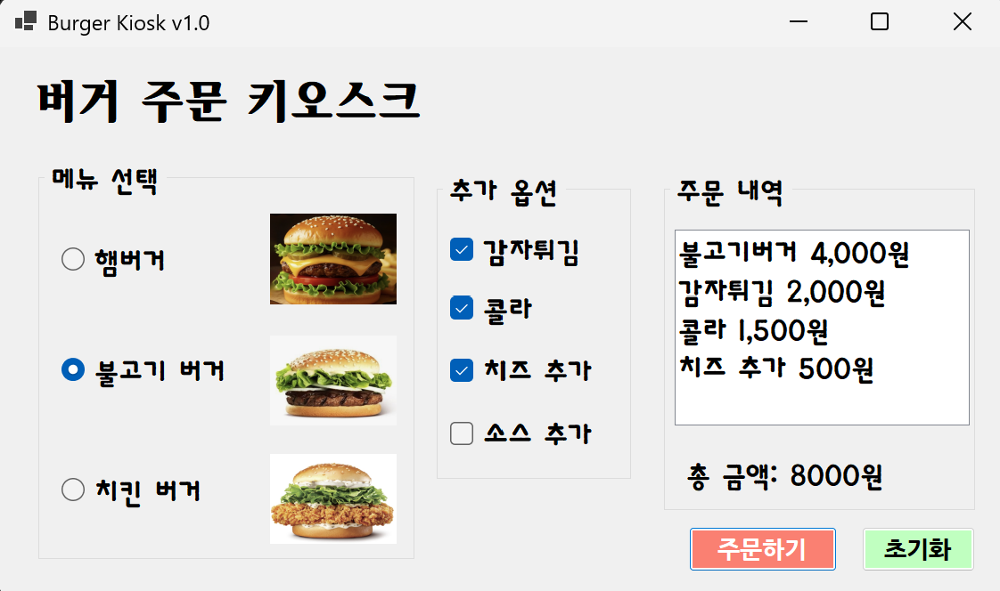
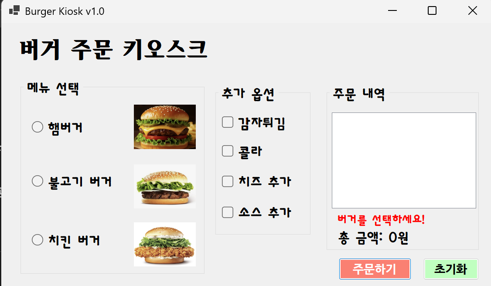
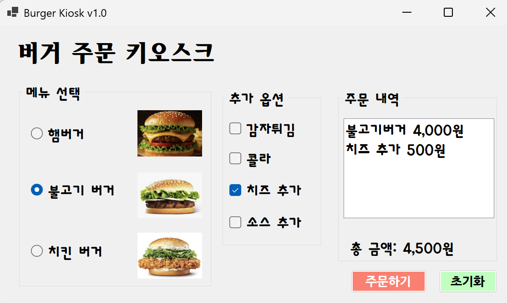
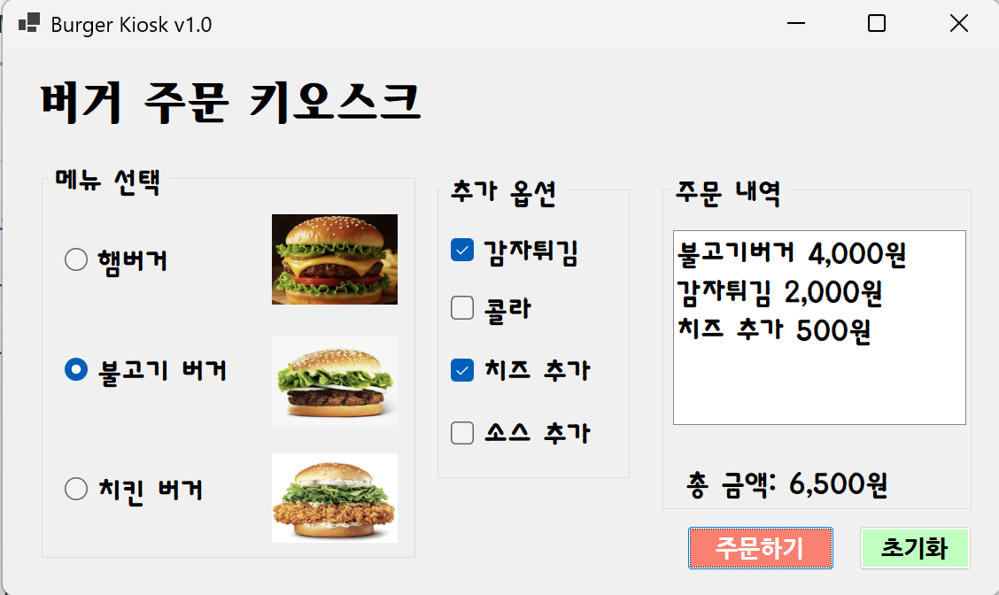

# (C# 코딩) 6주차 과제: Buger Kiosk (키오스크 주문 화면)
-이름: 하다현 (24018097)

## 개요
- C# 프로그래밍 학습
- 1줄 소개: 사용자로부터 아이디와 패스워드를 입력받아 로그인 여부를 판단하는 프로그램
- 사용한 플랫폼: C#, .NET Windows Forms, Visual Studio, GitHub, Visual Code
- 사용한 컨트롤: RadioButton, CheckBox, GroupBox, Label, PictureBox, ListBox, Button
- 사용한 기술과 구현한 기능:
  - Visual Studio를 이용하여 UI 디자인
  - 메뉴 선택 기능: RadioButton을 활용한 단일 메뉴 선택
  - 옵션 선택 기능: CheckBox를 활용한 복수 선택 처리
  - 가격 계산 기능: 선택된 항목들의 가격을 합산
  - 이벤트 처리: 버튼 클릭 시 전체 로직 실행
  - 조건문 활용: 선택 여부에 따른 분기 처리
  - UI 업데이트: 사용자 입력에 따라 화면 즉시 반영

---

## 실행 화면 
- 코드의 실행 스크린샷과 구현 내용 설명

- 구현한 내용 (위 그림 참조) 
  - ( 과제1 )
  - 메뉴선택 GroupBox(햄버거, 불고기 버거, 치킨 버거 RadioButton+ PictureBox)만들기, 추가 옵션 GroupBox(옵션 4개 CheckBox) 만들기, 주문내역 GroupBox(listBox 1개, 총 금액 Label 1개) 만들기, "주문하기"와 "초기화" 버튼 만들기
    +) GroupBox는 [도구상자]-[모든 Windows Forms]에 있음.
	이미지는 PictureBox 누르고 Image에서 원하는 사진 넣으면 됨.
	** SizeMode는 StretchImage로 설정 바꾸기(내가 원하는 이미지에 맞게 늘어남)
    cf) Label("버거 주문 키오스크") -> lblTitle
	RadioButton-"햄버거" -> rdoChickenBurger
			  "불고기 버거" -> rdoBulgogiBurger
			  "치킨 버거" -> rdoChickenBurger
	CheckBox-"감자튀김" -> chkPotato
		     -"콜라" -> chkCola
		     -"치즈" -> chkCheese
		     -"소스" -> chkSauce
	Button-"주문하기" -> btnorder
		 -"초기화" -> btnInit
	GruopBox-"메뉴선택" -> groupBoxMenu
		     -"추가옵션" -> groupBoxOption
		     -"주문 내역" -> groupBoxOrder
	Label-"총 금액" -> lblTotal
	ListBox -> lstOrder
	
			
  - 기본 UI 화면을 적절히 배치
  - GroupBox로 적절하게 그룹으로 묶기
  - 주문 내역(ListBox)과 총 금액(Label) 표시
  - 다시 주문할 수 있도록 초기화 버튼 만들기(rdoHamBurger.Checked = false; 이런 식으로 다 false로 써주면 됨.)
  - 주문하기 버튼 만들기(**int totalCost = 0;로 변수 초기화하기)

    +)
      - 메뉴 선택 영역을 구성하기 위해 GroupBox를 사용하였고, RadioButton을 이용하여 햄버거, 불고기 버거, 치킨 버거 중 하나만 선택할 수 있도록 구현하였다.
      - RadioButton의 특성을 이용하여 하나의 메뉴만 선택되도록 하였으며, 사용자가 직관적으로 메뉴를 고를 수 있도록 하였다.
      - 각 메뉴 옆에는 PictureBox를 배치하여 이미지가 함께 표시되도록 구성하였다. PictureBox의 Image 속성을 이용하여 이미지를 삽입하였으며, SizeMode를 StretchImage로 설정하여 이미지가 컨트롤 크기에 맞게 자연스럽게 표시되도록 하였다.
      - 추가 옵션 영역은 별도의 GroupBox로 구성하고 CheckBox를 이용하여 감자튀김, 콜라, 치즈, 소스 옵션을 선택할 수 있도록 구현하였다. CheckBox의 특성을 이용하여 여러 옵션을 동시에 선택할 수 있도록 하였다.
      - 추가 옵션 영역은 별도의 GroupBox로 구성하고 CheckBox를 이용하여 감자튀김, 콜라, 치즈, 소스 옵션을 선택할 수 있도록 구현하였다. CheckBox의 특성을 이용하여 여러 옵션을 동시에 선택할 수 있도록 하였다.
      - 주문하기 버튼 클릭 시 RadioButton과 CheckBox의 Checked 속성을 활용하여 사용자가 선택한 메뉴와 옵션을 판별하도록 구현하였다. 선택된 항목은 ListBox에 추가되며, 각 메뉴의 이름과 가격이 함께 출력되도록 하여 사용자가 주문 내용을 쉽게 확인할 수 있도록 하였다.
      - 초기화 버튼 클릭 시에는 모든 RadioButton과 CheckBox의 Checked 값을 false로 설정하여 선택 상태를 초기화하였고, ListBox의 Items.Clear()를 사용하여 주문 내역을 삭제하였다. 또한 Label의 텍스트를 "총 금액: 0원"으로 설정하여 초기 상태로 돌아가도록 구현하였다.

 ---

## 실행 화면 
- 코드의 실행 스크린샷과 구현 내용 설명

- 구현한 내용 (위 그림 참조) 
  - ( 과제2 )
  - 입력창 자동 초기화
  - 포커스 이동
  - Enter 키 전송
  - 공백 입력 방지

  - 로그인 실패 시 MessageBox를 사용하는 대신, 화면에 Label을 배치하여 오류 메시지를 표시하였다.
  - 평상시에는 Label을 숨겨두고(Visible = false), 로그인 실패 시에만 Visible을 true로 변경하여 메시지를 출력하였다.
  - 사용자 입장에서 어떤 부분이 잘못되었는지 직관적으로 확인할 수 있도록 UI를 개선하였다.

---

## 실행 화면 
- 코드의 실행 스크린샷과 구현 내용 설명

- 구현한 내용 (위 그림 참조) 
  - ( 과제3 )
  - 마우스를 사용하지 않고 키보드 입력으로만 주문 가능하도록 기능 추가함.
   (Tab, 방향키, 스페이스바 Enter 이용)

### 1. Tab 키를 이용한 GroupBox 이동
- Tab 키를 사용하여 메뉴 선택, 옵션 선택, 주문 영역(GroupBox) 사이를 이동할 수 있도록 구성함.
- 각 컨트롤의 `TabIndex`를 순서에 맞게 설정하여 자연스럽게 이동되도록 구현함.

### 2. 방향키를 이용한 선택 이동
- RadioButton(버거 메뉴)에서는 방향키를 이용하여 항목 간 이동 가능.
- 이는 기본적으로 Windows Form의 RadioButton 그룹 동작을 활용함.

### 3. 스페이스바를 이용한 아이템 선택
- RadioButton 및 CheckBox에서 스페이스바를 눌러 선택 및 해제가 가능하도록 구현.
- 메뉴 선택(RadioButton)과 옵션 선택(CheckBox)을 모두 키보드로 조작 가능.
- 사용자는 방향키로 이동 후 스페이스바로 선택하는 방식으로 주문 가능.

### 4. Enter 키를 이용한 버튼 실행
- Enter 키를 누르면 "주문하기" 버튼이 실행되도록 설정.
- Form의 `AcceptButton` 속성을 주문 버튼으로 지정하여 구현함.

---

## 실행 화면 
- 코드의 실행 스크린샷과 구현 내용 설명

- 구현한 내용 (위 그림 참조) 
  - ( 과제4 )
  - 메뉴를 선택하면 즉시 ListBox에 표시되도록 프로그램 구현.(총 금액도 즉시 갱신)
  
### 1. 선택 즉시 주문 내역(ListBox) 갱신
- 주문 내역(ListBox)은 기존 내용을 먼저 초기화(lstOrder.Items.Clear();)한 후 현재 선택된 항목들을 다시 추가하는 방식으로 구현하였다.
- RadioButton과 CheckBox의 Checked 속성을 확인하여 선택된 항목만 ListBox에 추가되도록 하였다.
- 예를 들어 햄버거가 선택되면 "햄버거 5,000원"과 같은 형식으로 ListBox에 출력되도록 하였고, 콜라를 선택하면 "콜라 2,500원"과 같이 추가되도록 하였다.

### 2. 선택 즉시 총 금액(Label) 갱신
- 총 금액(Label) 또한 선택이 변경되는 순간마다 자동으로 계산되도록 구현하였다.
- int totalCost = 0; 으로 변수를 초기화 -> 선택된 RadioButton과 CheckBox의 가격을 모두 더하도록 하였다.
- 각 메뉴와 옵션의 가격을 조건문을 통해 확인하고 totalCost에 누적하였다.
- 예를 들어 햄버거 선택 시 totalCost += 5000;, 콜라 선택 시 totalCost += 2500; 과 같이 구현하였다.

---

## 구현 시 어려웠던 점
- 키보드만으로 모든 기능을 조작할 수 있도록 구현하는 과정이 가장 어려웠다.
- 특히 Tab 키를 이용하여 각 GroupBox와 컨트롤 사이를 자연스럽게 이동하도록 설정하는 과정에서 TabIndex 값을 적절하게 배치하는 것이 쉽지 않았다.
- TabIndex가 올바르게 설정되지 않으면 포커스 이동 순서가 어색해지거나 원하는 컨트롤로 이동하지 않는 문제가 발생하였다.